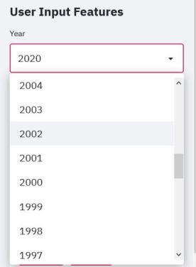
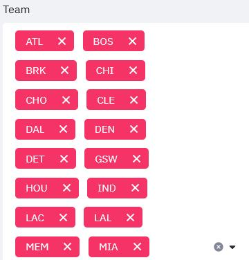
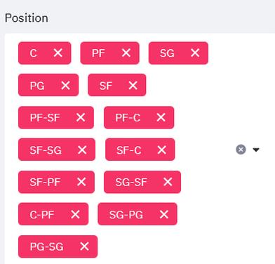
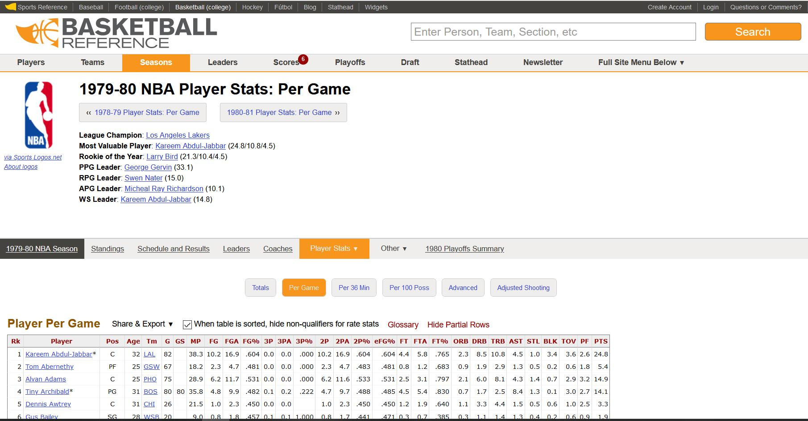
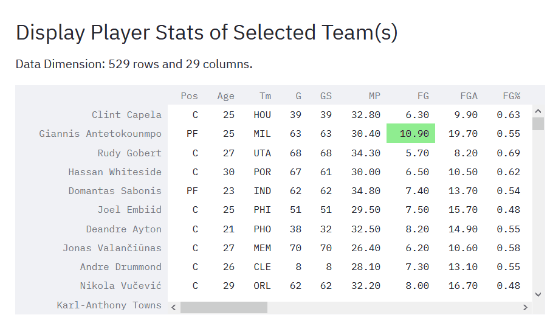
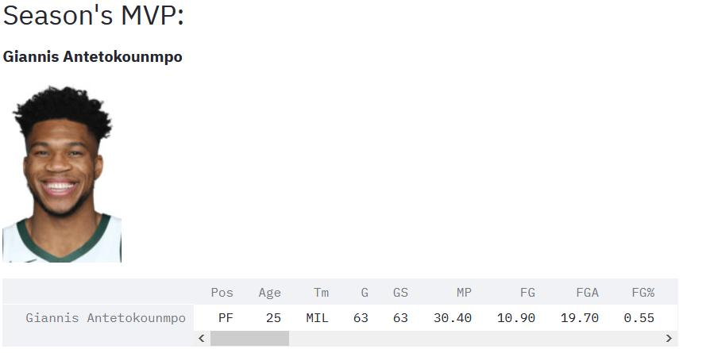
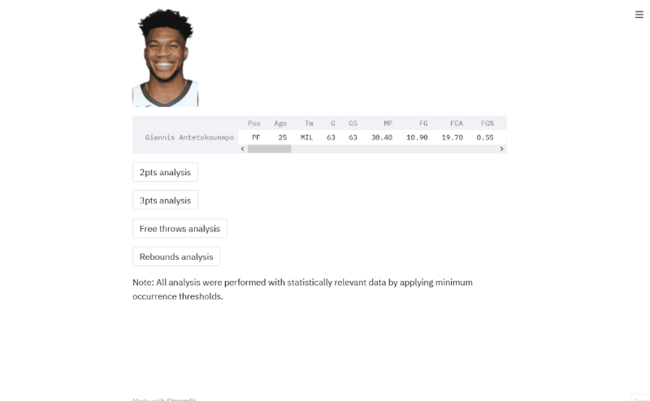

# NBA Scrapper

NBA Scrapper performs simple web scrapping and data analysis over player's stats.

 

## Table of contents
* [General info](#general-info)
* [Demo](#demo)
* [Technologies](#technologies)
* [Project description](#project-description)
* [Bug Or Feature Request](#bug-or-feature-request)

 

## General info
_____________________________

The app provides player's stats allowing the user to select the season and filter information by team and position.

Once everything is selected the app scraps the data from Basketball Reference and returns it as a DataFrame.

This is the **[original](https://www.basketball-reference.com/leagues/NBA_1980_per_game.html)**:

Data on the table is loaded into a dataframe for display.

There's some preprocessing before displaying the stats:

1. Drop the 'RK' (Ranking) column as it provides no information.
2. Drop the tables headers that are in the table as rows after a determined number of rows.
3. Complete all N/A with 0s and transform every numeric feature from string to int/float for latter processing.
4. Players being trade during the season have multiple values. For the sake of simplicity, we'll keep only the registry for the team he played last.

This is the outcome DataFrame for the app:

Similarly, using BeautifulSoup 🍲 library from Python we get the MVP of the season:

Finally, a simple data analysis of different shooting stats and rebounds 😁

But first, we need to talk a bit about preprocessing data.

### Preprocessing data
_____________________________
 

 With the spirit of presenting relevant data, we will show only players that accomplish a minimum amount of games played. According to the NBA the **[statistical minimum](https://www.nba.com/stats/help/statminimums/)** to be considered is 70% of his team's games.

As we're having % of shooting accuracy we need to do a bit of preprocessing to get rid of outliers. This could be the case of a player that has only one attempt at shooting a three and made it, and never attempting another shot again. With that spirit, we only took into consideration players which amount per game shot attempts over the first quartile.

### Visualization
_____________________________
 

With the above considerations presented, let's take a quick peek at the visualizations throught the *gif* below. The stats are plotted as a scatter where in the axis we find the Attempts per game and the Accuracy. The size of the bubbles is defined by the Points per game stat. Different colours relate to the player's position.

 

## Demo
_____________________________

You can visit the web app here 👉🏽  **https://nba-scrapper.herokuapp.com/**

## Technologies
_____________________________
Project was created with: 
* Python version: 3.8.6
* Heroku
* Streamlit
* Plotly
* BeautifulSoup

## Project description
_____________________________

### Data source

This project uses data from **[Basketball Reference](https://www.basketball-reference.com/)**

### Building the app

In order to let anyone use this application, we decided to deploy it on Heroku, a cloud Platform As a Service that allows us to develop, run, and manage the application without the complexity of building and maintaining the infrastructure typically associated with developing and launching an app.

### Visualisation 

To visualize the app we used Streamlit, a framework that allows us to turn the data scripts into a shareable web app. 

Plots are built using Plotly, a Python library to build interactive and graphic plots.

## Bug Or Feature Request
_____________________________

If you find a bug (the website couldn't handle the query and/or gave undesired results), kindly open an issue **[here](https://github.com/tomasaltilio/nbastats/issues/new)** by including your search query and the expected result.

If you'd like to request a new function, feel free to do so by opening an issue **[here](https://github.com/tomasaltilio/nbastats/issues/new)**. Please include sample queries and their corresponding results.